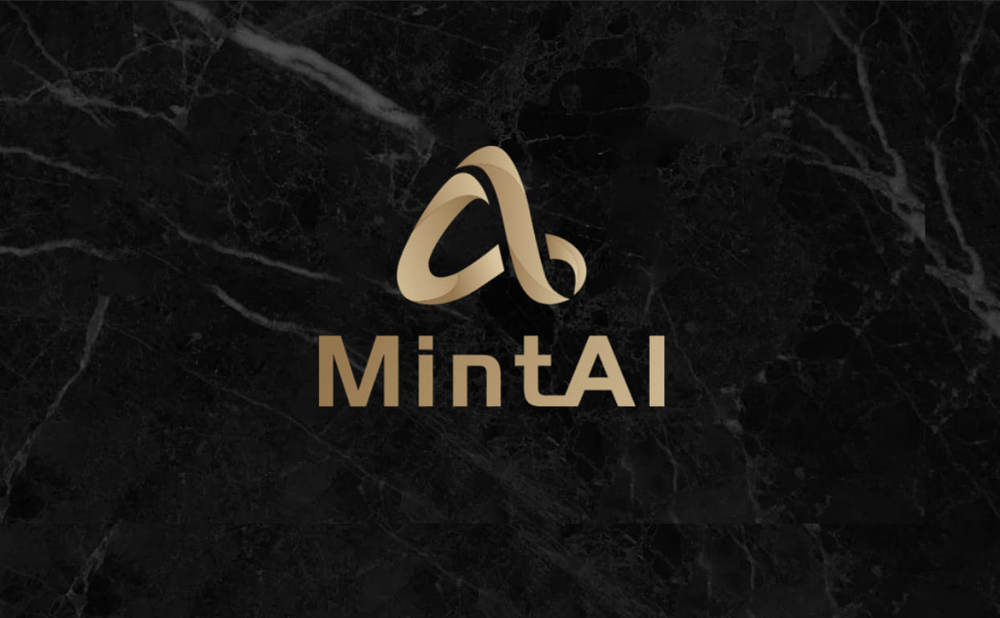
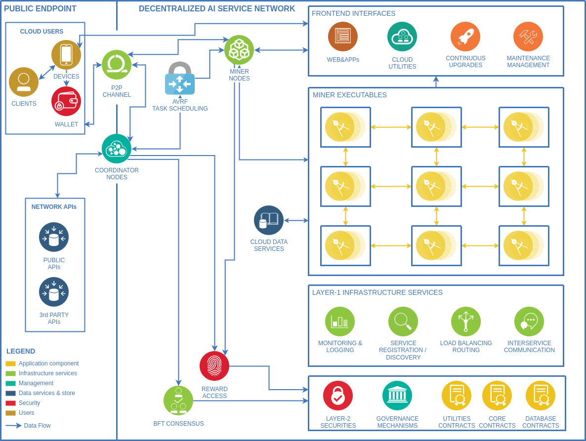

# MintAI Core: Reference Implementation of MintAI protocol



[![Version][version-badge]][version-url]
[![API Reference][api-badge]][api-url]
[![Go version][go-badge]][go-url]
[](https://discord.gg/r52AZRFb2T)
[![License][license-badge]][license-url]

[](https://visitorbadge.io/status?path=https%3A%2F%2Fgithub.com%2FDeAI-Artist%2FMintAI)

## Table Of Content
- [Introduction](#introduction)
- [Quick Start](#quick-start)
    - [Overview](#overview)
    - [Validator Nodes](#validator-nodes)
        - [Install MintAI](#install-mintai)
        - [Initialize the Validator Node](#initialize-the-validator-node)
        - [Start the Validator Node](#start-the-validator-node)
        - [Send Transactions](#send-transactions)
        - [Transaction Fees](#transaction-fees)
    - [Worker Nodes](#worker-nodes)
    - [Minimum Requirements](#minimum-requirements)
- [MintAI Tokens](#mintai-tokens)
    - [Overview](#overview-1)
- [Versioning](#versioning)
    - [Semantic Versioning](#semantic-versioning)
    - [Upgrades](#upgrades)
    - [Supported Versions](#supported-versions)
- [Resources](#resources)
    - [Research](#research)
- [Contribution](#contribution)
## Introduction
Tendermint Core includes both Layer-1 (L1) and Layer-2 (L2) implementations. L1 coordinates and records network activities, securely replicating them across many machines. Meanwhile, L2 contracts handle the storage and transportation of value, including coins and tokens in all kinds of types and formats.

<p align="center">
  
  <br>
  <em><strong>Figure 1:</strong> Overview of the decentralized AI service network components and their interactions.</em>
</p>

For protocol details, refer to the [MintAI WhitePaper](https://mintai.gitbook.io/whitepaper/).

For a detailed analysis of the consensus framework in the L1 layer, including BFT safety and liveness proofs, refer to the paper, "[The latest gossip on BFT consensus](https://arxiv.org/abs/1807.04938)" and its corresponding [Tendermint GitHub repo](https://github.com/tendermint/tendermint).


_NOTE: This is only the dev version of MintAI core, both in the L1 and L2 implementations, for testnet purposes. As the project progresses, we are excited to include more features in both layers and anticipate major upgrades compared to the current versions. We warmly welcome any kind of contributions! For more information, see [our contribution policy](SECURITY.md)._

## Quick Start
### Overview
The network is composed of validators, service providers (miners), and clients. To earn network rewards, you need to either participate as a service provider or a validator.

### Validator nodes
Validators are responsible for securing the network by proposing and validating new blocks. To set up a validator node, follow these steps:

#### Install MintAI:
```shell
git clone https://github.com/DeAI-Artist/MintAI.git
cd MintAI
make build
make install
```
#### Initialize the validator node:
```shell
mintai init
```
#### Start the validator node:
```shell
mintai node
```
From here your validator node is up and running :)

> Note: The current implementations listen to all incoming transactions through the p2p module. To run a local node for testing purposes, modify the configuration file located at `.mintai/config/.config.toml`. Inside the file, change `laddr = "tcp://0.0.0.0:26656"` to `tcp://127.0.0.1"` to restrict network access to localhost only.

#### Send transactions:
The general transaction format in the MintAI network is:
```shell
curl -s 'RPC_laddr:26657/broadcast_tx_commit?tx="TX_CONTENT"'
```
For example, if we register a client with the `client_name` field set to `Client1`, have one of the validators' `RPC_laddr` as `134.209.85.94`, and set `TX_CONTENT` as `0000003b7b22636f6e74...`, then:
```shell
curl -s '134.209.85.94:26657/broadcast_tx_commit?tx="0000003b7b22636f6e74656e74223a2265794a6a62476c6c626e5266626d46745a534936496b4e73615756756444456966513d3d222c2274797065223a317dffef7045be04d7de12b68871a6837c67e26a0d89ca4af124bf0b449041f12a6b25f4d388962f0f7e704cfc93f8a47ba0dc9b15118819cf2067ecd9542b17b4251c"'
```
with the expected output as follows:
```text
{"jsonrpc":"2.0","id":-1,"result":{"check_tx":{"code":0,"data":null,"log":"","info":"","gas_wanted":"0","gas_used":"0","events":[],"codespace":"","sender":"","priority":"0","mempoolError":""},"deliver_tx":{"code":0,"data":null,"log":"","info":"","gas_wanted":"0","gas_used":"0","events":[{"type":"app","attributes":[{"key":"dHJhbnNhY3Rpb24gc2VuZGVy","value":"MHg2YzI1YjcyQ0Q2ODA3RDEwNjc4QjQ1N0I2RTYzRkI3OTNhZTAzMEVi","index":true}]}],"codespace":""},"hash":"39EB7DB89963695E683D862C48C1EB167C757E74E435D6B0C3505A12FE4B4686","height":"88083"}}
```
If `check_tx` and `deliver_tx` have a `code` of `0`, then the transaction is successfully validated and processed, with its content being included in the global states.
We can validate this by using the `query` API on another validator in the network with the command below:
```shell
curl -s '178.128.168.223:26657/abci_query?data="clientRegistration_0x6c25b72CD6807D10678B457B6E63FB793ae030Eb"'
```
To send transactions that can be passed into the mempool, one needs to formulate the transaction according to the message type and transaction format specified in this [doc](./spec/abci/abci.md).

#### Transaction fees:
Unlike interacting with mainnets like Solana or Ethereum, MintAI L1 transactions are completely **free of gas fees**, allowing clients to navigate the network without any economic friction.
One can refer to the [MintAI protocol](https://arxiv.org/pdf/2310.19099) to understand how this is accomplished in a secure and robust manner.

### Worker nodes
The MintAI protocol coordinates services by routing clients' requests to workers (miners) in the network. Participating as a worker can help one earn network rewards based on the amount of services they have accepted and completed (through network transactions). To start with a certain `RPCENDPOINT`:
```shell
mintai service-start --rpc-endpoint ${RPCENDPOINT}
```
It will prompt the user for some registration info and wallet generation.

> Note: The `service-start` command is still under development and will become fully functional with the launch of the testnet. This command aims to simplify the process for anyone with the necessary resources to set up a worker node.

### Minimum requirements

| Requirement | Notes             |
|-------------|-------------------|
| Go version  | Go 1.18 or higher |

## MintAI tokens
### Overview
The MintAI token (MAI) is the primary utility token supporting network participants such as clients, workers, and validators. Participants are required to hold a certain amount of tokens to be accepted into the MintAI network. Clients must hold tokens to use AI and ML services on the network, while validators need to stake tokens to gain the voting power necessary for recording network activities. Consequently, the MintAI token should have the following considerations:
- **Security**: Mainnets supporting MAI should be secure, typically characterized by a large Total Value Locked (TVL) and a broad community base.
- **Upgradability**: MAI utilizes proxy contracts, allowing for updates to system logic and design without impacting the underlying database.
- **Cross-chain Capability**: Cross-chain functionality improves accessibility, enabling holders of various cryptocurrencies to engage with the MintAI network and utilize AI and ML services.
- **User Experience**: MAI should operate on chains known for low transaction fees and fast confirmation times, ensuring a smooth user experience.

| Feature\Mainnets            | BSC<br/>  | Ethereum<br/>    | Polygon<br/> | Solana<br/>             | Near<br/>        | Tron<br/>                |
|-----------------------------|---------------------------------------|-------------------------------------|-------------------------------------|------------------------------------------------|-----------------------------------------|--------------------------------------------|
| **Security**                | ✅ Large TVL, Large User Base          | ✅ Large TVL, Large User Base        | ✅ Growing community size            | ✅ Large TVL, Large User Base ⚠️Fair robustness | ⚠️ Fair TVL and moderate community base | ✅ Large TVL, Large User Base                        |
| **Upgradability**           | ✅ Proxy contracts patterns            | ✅ Proxy contracts patterns          | ✅ Proxy contracts pattern           | ✅ Upgradable by upgrad authority               | ✅ Upgradable contracts                  | ✅ Proxy contracts patterns                          |
| **Developer Tools**         | ✅ Many frameworks and tools available | ✅ Many frameworks and tools available      | ✅ Well-supported development tools  | ✅ Growing ecosystem of tools                   | ✅ Well-supported development tools        | ✅ Many frameworks and tools available           |
| **Transaction Efficiency**  | ✅ Low fees, fast times                | ❌ Extremely high fees, slower times | ⚠️ Low fees, but slow speed          | ✅✅ Super-fast, Super low fees                  | ✅ Low fees, fast times                        | ✅ Low fees, fast times                 |

Based on the analysis of different main chains, we decided to use the ERC-20 protocol on Binance Smart Chain using [proxy contract patterns](https://github.com/DeAI-Artist/MintAI/tree/main/contracts/contracts). AI is an industry subject to high evolution speed, and all token and utility contracts should be upgradable except the database contracts. Given the growing size of the MintAI network, cross-chain features will also be gradually supported so that MAI can be transferred between chains such as Solana and Tron.

## Versioning

### Semantic Versioning

MintAI uses [Semantic Versioning](http://semver.org/) to determine when and
how the version changes. According to SemVer, anything in the public API can
change at any time before version 1.0.0

To provide some stability to users of 0.X.X versions of MintAI, the MINOR
version is used to signal breaking changes across MintAI's API. This API
includes all publicly exposed types, functions, and methods in non-internal Go
packages as well as the types and methods accessible via the MintAI RPC
interface.

Breaking changes to these public APIs will be documented in the CHANGELOG.

### Upgrades

In an effort to avoid accumulating technical debt prior to 1.0.0, we do not guarantee that breaking changes (i.e., bumps in the MINOR version) will work with existing MintAI blockchains. In these cases, you will have to start a new blockchain or write something custom to get the old data into the new chain. However, any bump in the PATCH version should be compatible with existing blockchain histories.

### Supported Versions

Because we are a small core team, we only ship patch updates, including security updates, to the most recent minor release and the second-most recent minor release. Consequently, we strongly recommend keeping MintAI up-to-date when joining as validator or worker nodes. We will try our best to ensure that every major upgrade will be technically supported to the extent that the validator node restart will be as smooth as possible.
## Resources

### Research
- [MintAI Protocol](https://mintai.gitbook.io/whitepaper/)
- [Proof of Training](https://arxiv.org/pdf/2307.07066)
- [DeAI Overview](https://arxiv.org/pdf/2310.19099)
- [The latest gossip on BFT consensus](https://arxiv.org/abs/1807.04938)
- [Master's Thesis on Tendermint](https://atrium.lib.uoguelph.ca/xmlui/handle/10214/9769)

## Contribution
We appreciate your interest in contributing to our open-source initiative. We'll provide a document of contribution guidelines soon, outlining the steps for contributing to MintAI. We welcome contributions from anyone on the internet and are grateful for even the smallest of fixes🤝!

[bft]: https://en.wikipedia.org/wiki/Byzantine_fault_tolerance
[smr]: https://en.wikipedia.org/wiki/State_machine_replication
[Blockchain]: https://en.wikipedia.org/wiki/Blockchain
[version-badge]: https://img.shields.io/github/tag/tendermint/tendermint.svg
[version-url]: https://github.com/DeAI-Artist/MintAI/releases/latest
[api-badge]: https://img.shields.io/badge/API-Online-brightgreen
[api-url]: https://pkg.go.dev/github.com/DeAI-Artist/MintAI
[go-badge]: https://img.shields.io/badge/go-1.21-blue.svg
[go-url]: https://github.com/moovweb/gvm
[discord-badge]: https://img.shields.io/discord/669268347736686612.svg
[discord-url]: https://discord.gg/cosmosnetwork
[license-badge]: https://img.shields.io/badge/License-GPL--3.0-lightgreen
[license-url]: https://github.com/DeAI-Artist/MintAI/blob/main/LICENSE
[sg-badge]: https://sourcegraph.com/github.com/DeAI-Artist/MintAI/-/badge.svg
[sg-url]: https://sourcegraph.com/github.com/DeAI-Artist/MintAI?badge
[tests-url]: https://github.com/DeAI-Artist/MintAI/actions/workflows/tests.yml
[tests-badge]: https://github.com/DeAI-Artist/MintAI/actions/workflows/tests.yml/badge.svg?branch=main
[lint-badge]: https://github.com/DeAI-Artist/MintAI/actions/workflows/lint.yml/badge.svg
[lint-url]: https://github.com/DeAI-Artist/MintAI/actions/workflows/lint.yml
